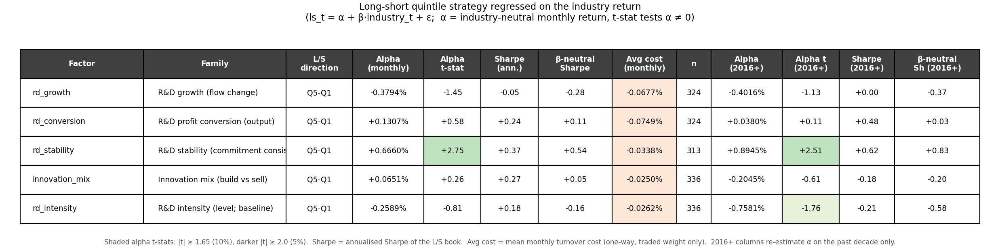
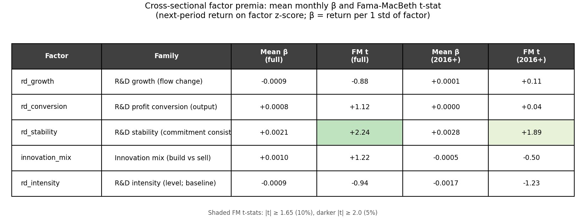
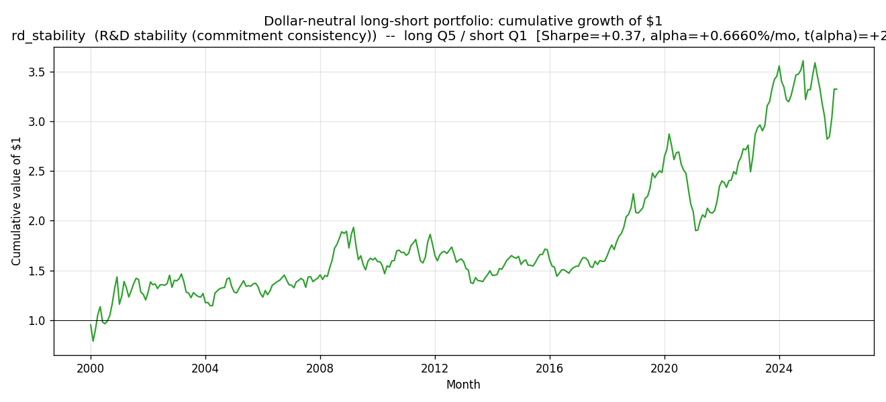
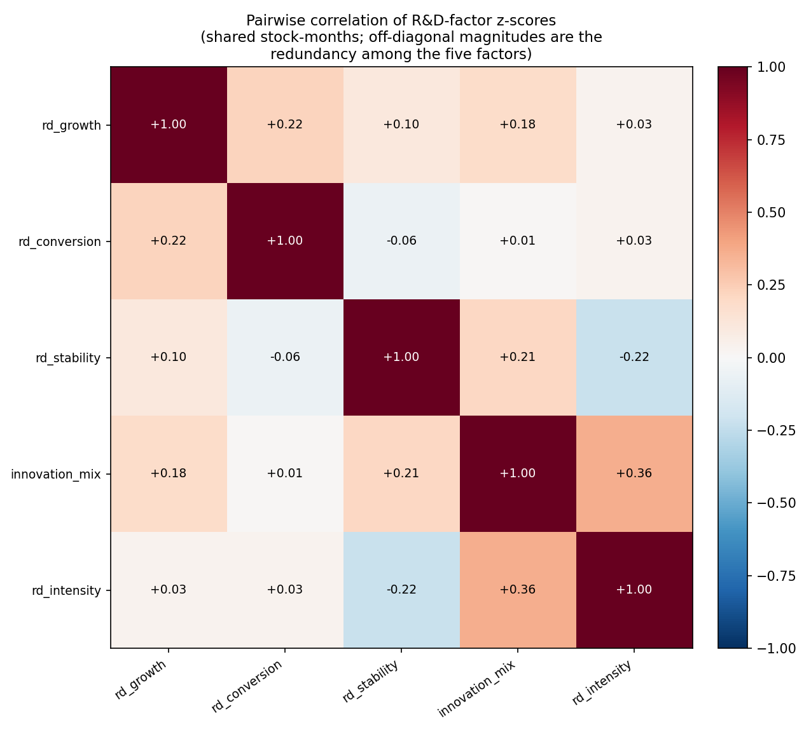
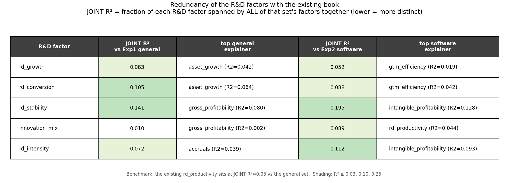

# R&D Factors — Software & Services

**Industry-specific, non-conventional equity factors built from the *R&D behavior* of software companies**

*Experiment 2 extension. Universe: GICS Software & Services. Sample: 1998-01 → 2026-01 (337 months, ~270–340 stocks/month). Tested under the Experiment 2 pipeline (even-quintile sorts + monthly Fama–MacBeth regressions, industry-neutral long/short alpha, turnover-cost model). All fundamentals are point-in-time (attached on `observation_date`, no look-ahead). Outputs: `RD/`.*

---

## 0. The idea in one paragraph

The project already prices three R&D-*adjusted* characteristics — `intangible_value`, `intangible_profitability` and `rd_productivity` — but all three are **levels / valuation** signals built on the slow-moving accumulated R&D capital stock `K_int`. None of them measures the **dynamics and discipline of R&D spending itself**. This note proposes four factors that target four distinct *behavioral* dimensions of R&D the existing book is blind to — **flow, profit-output, consistency, and composition** — plus the conventional R&D-intensity *level* retained only as a baseline for contrast. The thesis we set out to test: *within a single R&D-intensive industry, how a firm manages R&D carries more cross-sectional information than how much R&D it has.*

| # | Factor | R&D-behavior dimension | Definition | Hypothesised direction |
|---|--------|------------------------|------------|------------------------|
| 1 | `rd_growth` | **Flow** (is R&D ramping?) | Δ(R&D, YoY) / avg assets | long high |
| 2 | `rd_conversion` | **Profit output** (does R&D convert to *margin*?) | Δ(gross income, YoY) / sales₍ₜ₋₁₂₎ | long high |
| 3 | `rd_stability` | **Consistency** (is the R&D programme disciplined?) | − trailing-36m coeff. of variation of (R&D/sales) | long high |
| 4 | `innovation_mix` | **Composition** (build vs sell?) | R&D / (R&D + SG&A) | long high |
| 5 | `rd_intensity` *(baseline)* | **Level** (how much R&D?) | R&D / sales | long high |

> **Why these are non-conventional.** Conventional R&D factors stop at the *level* of R&D (R&D/sales or R&D/market-cap). Three of our four are time-derivatives or moments of R&D behaviour rather than levels — and one of them (`rd_stability`) is a **second moment**, a type of signal that appears *nowhere* in the existing 15-factor book. They are all "straightforward" in the sense the brief asks: each is a single ratio, a year-over-year change, or one trailing-window moment computed from fields already in the data — no multi-step estimation.

---

## 1. Why R&D behavior should carry a premium — and why it survives

Everything below rests on **one permanent accounting fact** and **one permanent behavioral fact**:

- **Accounting (permanent).** Under ASC 730 / IAS 38, R&D is **expensed**, not capitalised. A dollar of R&D hits the income statement immediately and *never* appears as a balance-sheet asset with a visible depreciation schedule. So R&D-active firms' GAAP earnings, assets, and book value systematically *understate* economic reality, and conventional screens (P/E, P/B, ROA, asset growth) misread them. This treatment has been stable for decades and is not on any standard-setter's agenda.
- **Behavior (permanent).** Investors anchor on reported earnings ("functional fixation"); the sell-side in software fixates on revenue/bookings. Both under-weight investment that arrives as an *expense* and over-weight revenue that is *bought* rather than *earned*.

Together these produce mis-pricings that (i) **renew with every technology wave** (each wave creates a fresh cohort of R&D-ramping firms), (ii) **resist arbitrage** because R&D payoffs are multi-year, noisy, and require holding names with optically poor near-term profitability through the wait — career-risky and drawdown-prone, so fast money won't carry them, and (iii) **are not in vendor factor libraries**, which are overwhelmingly point-in-time cross-sectional ratios, not panel-constructed changes or moments. That is the structural reason these signals can persist without being competed away.

The four behavioral factors each isolate a *different* face of this mis-pricing. The sections below give, for each: the **predicting logic**, **why it stays robust**, **why it is not a re-skin of an existing factor**, **why it persists / has not been arbitraged**, and an **ex-ante prediction of sign and magnitude**.

---

## 2. The factors (ex-ante hypotheses)

> Throughout, the long/short book is signed by the **hypothesised** direction (`higher_is_bullish = True` for all five), *not* by the in-sample t-stat. So a *negative* realised alpha t-stat means the factor worked **against** the hypothesis — the comparison in §4 reads directly off the sign.

### 2.1 `rd_growth` — the flow: is R&D ramping? *(long high)*

**Definition.** `(rd_ltm − rd_ltm₍ₜ₋₁₂₎) / ½(assets + assets₍ₜ₋₁₂₎)` — the year-over-year change in R&D spending, scaled by average total assets. This is the **intangible-investment analogue of `asset_growth`**, built to be directly contrastable with it.

**Predicting logic.** A firm raising R&D/assets is voluntarily depressing current GAAP earnings to build off-balance-sheet intangible capital whose payoff is deferred. Earnings-anchored investors under-react to investment that shows up as an *expense* rather than a capitalised asset. So accelerating "disguised investment" should mark firms whose near-term earnings most understate economic earnings — and earn positive abnormal returns as the payoff arrives (Eberhart, Maxwell & Siddique 2004 document multi-year positive abnormal returns after large R&D increases).

**Why robust.** Rests on the permanent expensing rule plus permanent earnings-fixation; it is a ratio (currency-, size-, inflation-neutral) defined for every R&D reporter, and self-renewing across waves.

**Why not correlated with existing factors.** The crucial point is the **sign flip vs `asset_growth`**: tangible asset/capex growth predicts *low* returns (the investment anomaly), but R&D is expensed and **never enters `assets`**, so `rd_growth` captures exactly the investment that `asset_growth` is structurally blind to — with the *opposite* expected sign. It is a *flow change*, so it shares little variance with the slow-moving *level* signals `intangible_value`/`intangible_profitability` (which live in a 0.20-decay `K_int` stock). Vs `rd_productivity` (Δsales/`K_int`, an *output* measure) it is an *input-commitment* measure that is high precisely *before* sales respond.

**Why persistent / not arbitraged.** Behavioral fixation on EPS + no capitalised-asset line to correct the anchor + a multi-year, noisy payoff that requires being long names with *deteriorating reported profitability* through the wait.

**Prediction.** Long high; **moderate, |t(α)| ≈ 2–3.** A single-industry sort controls the sector innovation cycle; YoY-change noise caps it below "strong." *Anchor: Eberhart, Maxwell & Siddique (2004); Lev & Sougiannis (1996); Cohen, Diether & Malloy (2013).*

### 2.2 `rd_conversion` — the profit output: does R&D convert to *margin*? *(long high)*

**Definition.** `(gross_income_ltm − gross_income_ltm₍ₜ₋₁₂₎) / sales_ltm₍ₜ₋₁₂₎` — the YoY change in **gross profit**, scaled by prior-year sales (a stable, always-positive base — deliberately **not** `K_int`).

**Predicting logic.** `rd_productivity` asks whether R&D produces *sales* — but in software, sales can be bought with discounting or unprofitable land-grab, so revenue is a weak proxy for value created. The economically decisive question is whether R&D converts into **gross profit**: durable, high-margin, pricing-power output (gross income nets out COGS / hosting). Rewarding margin-accretive innovation and penalising low-margin revenue-chasing is precisely the profit-vs-sales distinction the existing book misses. Notably, **`rd_productivity` printed a *negative* alpha (t ≈ −1.5) in Experiment 2** — consistent with raw sales-per-R&D rewarding the wrong thing; switching the output measure to *profit* is designed to repair that documented failure.

**Why robust.** Inherits the robustness of the gross-profitability anomaly (Novy-Marx 2013 — gross margin is the least-manipulable profitability line) applied to the innovation-output question, and is built on large, stable accounting lines (lower noise than change/second-difference factors).

**Why not correlated with existing factors.** Distinct from `rd_productivity` on **both** axes — numerator (gross *profit* vs sales) and denominator (a safe sales base vs the unstable `K_int`); they diverge for exactly the firms that matter (a firm buying unprofitable growth scores high there, low here). Vs `gross_profitability` (gross_income/assets, Exp1) it is a *change* normalised by lagged sales, isolating the *increment* rather than the static level. Vs `operating_leverage` (Δopinc/Δsales) it uses *gross* not operating income and a *prior-sales* (not Δsales) base.

**Why persistent / not arbitraged.** Sell-side over-rewards top-line/bookings and under-rewards their *profitability*; gross-margin attribution to R&D vintages is not disclosed (you must construct it); shorting margin-poor revenue-growers is painful while their revenue still visibly grows (the Lev–Sougiannis under-incorporation has survived 25+ years of publication).

**Prediction.** Long high; **moderate-to-strong, |t(α)| ≈ 2.5–3.** Our highest-conviction *standalone* of the four — two robust mechanisms (R&D output conversion + the gross-margin channel) on low-noise inputs. *Anchor: Lev & Sougiannis (1996); Novy-Marx (2013); Peters & Taylor (2017).*

### 2.3 `rd_stability` — the consistency: is the R&D programme disciplined? *(long high)*

**Definition.** `− std₃₆ₘ(R&D/sales) / mean₃₆ₘ(R&D/sales)` per stock (negative trailing-36m coefficient of variation; ≥24 valid months required). High (near 0) = a steady, committed R&D programme; very negative = erratic spending.

**Predicting logic.** Steady R&D is the signature of a governance-disciplined, multi-year innovation programme; volatile intensity is the signature of **real-activities earnings management** — managers cut discretionary R&D to hit EPS targets (Graham, Harvey & Rajgopal 2005: a *majority* of CFOs admit they would). Because R&D is expensed, cutting it boosts reported earnings dollar-for-dollar this quarter while mortgaging future cash flow. A firm that holds intensity steady is signalling it is *not* pulling that lever — higher-quality, more persistent earnings, a dimension the market under-prices.

**Why robust.** Rests on a permanent agency conflict (managerial myopia under earnings pressure) + permanent expensing. It is a unit-free dispersion measure and the 36-month window makes it slow-moving → **low turnover → low transaction cost**.

**Why not correlated with existing factors.** It is the **only second-moment signal in the entire 15-factor book** — every other factor is a level or a first difference. By construction (dispersion ÷ mean) it carries *no* information about the *level* of R&D, so it is orthogonal to `intangible_value`/`intangible_profitability`/`rd_productivity`, and it separates cleanly from `rd_growth` (a one-off spike scores *high* on growth but *low* on stability). Vs `accruals` (Exp1): accruals catch *accrual-based* manipulation, but cutting a real cash expense is *real-activities* manipulation that leaves accruals untouched (it actually *raises* operating cash flow) — a channel accruals structurally cannot see. It is not `beta` (that is *return* volatility, not *fundamental-flow* volatility).

**Why persistent / not arbitraged.** Requires a **per-stock 36-month panel moment** — absent from vendor libraries of point-in-time cross-sectional ratios — and a long, catalyst-free payoff horizon unattractive to event-driven capital. The premium is compensation for *not* being exposed to opportunistic R&D cutting, a risk invisible without explicitly computing the moment.

**Prediction.** Long high (steady); **weak-to-moderate, |t(α)| ≈ 1.5–2.5.** Earnings-quality / stability premia are real but diffuse, and the monthly t-stat is compressed by the slow payoff; we expected its main value to be *diversification* (near-zero correlation to the rest of the book). *Anchor: Graham, Harvey & Rajgopal (2005); Roychowdhury (2006); Bushee (1998); the quality-stability lineage (Asness–Frazzini–Pedersen QMJ).*

### 2.4 `innovation_mix` — the composition: build vs sell? *(long high)*

**Definition.** `rd_ltm / (rd_ltm + sga_ltm)` — R&D as a share of total discretionary (expensed) spend. Range [0, 1].

**Predicting logic.** R&D and SG&A are both expensed and both depress current earnings, but they are economically opposite: R&D builds a durable, off-balance-sheet intangible asset; much of SG&A — especially S&M — *rents* current revenue that evaporates when you stop paying. GAAP buries both in one "expensed" bucket, so two firms with identical margins can have radically different *quality of spend*. A firm tilting its discretionary dollar toward R&D accumulates more off-balance-sheet capital per dollar of reported expense; the market sees only the aggregate margin hit, not the build-vs-burn composition underneath.

**Why robust.** A pure cross-sectional ratio of two large, stable reported line items — no estimation, no window, defined every month for every firm reporting both — encoding a permanent economic distinction (capital-building vs revenue-renting spend).

**Why not correlated with existing factors.** Vs `gtm_efficiency` (Δsales/SG&A) it measures the *allocation* between building and selling, not the *productivity* of the selling dollar — different numerators (R&D vs Δsales); the signals diverge for any sales-led but sales-efficient grower. Vs `intangible_profitability` (a profitability *level* over an asset+`K_int` base) it has no profit/asset/price term at all. The only overlap to monitor is a mild positive tilt with `gross_profitability` (R&D-led firms tend to higher margins).

**Why persistent / not arbitraged.** Line-item aggregation into operating expense hides the mix from headline screens (most quant pipelines never decompose opex); investors reward visible S&M-driven "land-grab" growth and under-reward quiet product investment; the penalty for sell-tilted growth (margin erosion when S&M can no longer be cut) surfaces years later, beyond the arbitrage horizon. Clean R&D/SG&A splits are noisy *across* industries — the within-software setting is exactly where the edge exists.

**Prediction.** Long high (R&D-tilted); **moderate, |t(α)| ≈ 2.** A composition/quality tilt rather than a sharp predictor, with likely mild concavity at the extreme (a very high R&D share can flag a distressed pre-revenue firm that slashed S&M) — so the even-quintile sort should read it better than the linear FM slope. *Anchor: Peters & Taylor (2017); Enache & Srivastava (2018); Eisfeldt–Papanikolaou (organisation capital).*

### 2.5 `rd_intensity` — the level (conventional baseline) *(long high)*

**Definition.** `rd_ltm / sales_ltm` — the textbook R&D-intensity ratio. Retained **only as the conventional anchor**: it is a *level*, not a behavior, and is the most widely studied R&D signal (Chan, Lakonishok & Sougiannis 2001). Its job here is to let us test the central thesis — *does R&D **behavior** beat the R&D **level**?* — head-to-head.

**Prediction.** Long high; **modest, |t(α)| ≈ 1–2**, but flagged ex-ante as the *least* reliable of the five, with explicit downside risk that the post-2016 de-rating of unprofitable, high-spend software could push its industry-neutral alpha *negative* in the recent sub-sample.

### Summary of ex-ante predictions

| Factor | Dimension | Predicted direction | Predicted \|t(α)\| | Conviction |
|--------|-----------|--------------------|--------------------|-----------|
| `rd_conversion` | profit output | long high (+) | 2.5–3 | highest standalone |
| `rd_growth` | flow | long high (+) | 2–3 | moderate |
| `innovation_mix` | composition | long high (+) | ~2 | moderate |
| `rd_stability` | consistency | long high (+) | 1.5–2.5 | diversifier |
| `rd_intensity` | level (baseline) | long high (+) | 1–2 | low (de-rating risk) |

---

## 3. How they were tested (Experiment 2 pipeline)

Identical machinery to Experiments 1–2, reused **unmodified** via dependency injection (`main_rd.py` registers `rd_factors` as `sys.modules["factors"]`, so Experiment 1's `quintile.py` / `regression.py` / `cost.py` run against these factors with zero code changes):

- **Point-in-time fundamentals.** R&D, sales, SG&A, assets and gross income are attached to each month-end by a backward as-of merge on `observation_date` (a report enters month *t* only once it was observable) — the project's standard look-ahead fix.
- **Standardisation.** Each factor is winsorised at 1%/99% and z-scored within each month, relative to the industry mean.
- **Approach 1 — even-quintile sorts.** Five equal-count buckets on the z-score each month; the **next-month** mean return of each, the Q5−Q1 spread, its t-stat and Sharpe.
- **Approach 2 — Fama–MacBeth.** Monthly cross-sectional OLS of next-month return on the z-score; the time-series mean slope and its FM t-stat (full sample and 2016+).
- **Industry-neutral alpha.** The signed dollar-neutral long/short book is regressed on the **market-cap-weighted** industry return (each name weighted by its USD market cap); **α (and t(α)) is the headline** — return not explained by industry exposure. Average monthly **turnover cost** (one-way, charged on traded weight only) is reported alongside.
- **Redundancy.** Experiment 3's panel-agnostic `factor_correlation.run` measures each R&D factor's R² against (a) the 9 Exp1 general factors and (b) the 6 Exp2 software factors; `rd_diagnostics.py` adds the 5×5 cross-correlation among the R&D factors themselves.

Outputs: `RD/{factor_panel.csv, quintile/…, regression/…, factor_correlation/…}`.

---

## 4. Results & comparison to the hypotheses

### 4.1 Headline — industry-neutral long/short alpha (canonical long-high direction)

> **Benchmark convention (updated).** α below is now measured against the **market-cap-weighted** industry return (each name weighted by its USD market cap), not the equal-weighted mean of companies. This recalibrates the α's and industry βs versus a mega-cap-dominated benchmark; the gross Q5−Q1 spreads, Fama–MacBeth t-stats, Sharpe and turnover costs do not reference the benchmark and are unchanged. All verdicts below hold.

| Factor | Gross Q5−Q1 /mo | **α /mo** | **t(α)** | FM t (full) | α 2016+ | t(α) 2016+ | FM t 2016+ | Sharpe | Avg cost (pp/mo) |
|--------|---:|---:|---:|---:|---:|---:|---:|---:|---:|
| **`rd_stability`** | +0.49% | **+0.67%** | **+2.75** | **+2.24** | **+0.89%** | **+2.51** | +1.89 | 0.37 | 0.034 |
| `rd_conversion` | +0.29% | +0.13% | +0.58 | +1.12 | +0.04% | +0.11 | +0.04 | 0.24 | 0.075 |
| `innovation_mix` | +0.38% | +0.07% | +0.26 | +1.22 | −0.20% | −0.61 | −0.50 | 0.27 | 0.025 |
| `rd_growth` | −0.07% | −0.38% | −1.45 | −0.88 | −0.40% | −1.13 | +0.11 | −0.05 | 0.068 |
| `rd_intensity` *(baseline)* | +0.37% | −0.26% | −0.81 | −0.94 | −0.76% | −1.76 | −1.23 | 0.18 | 0.026 |

*(α and t(α): industry-neutral monthly alpha of the Q5−Q1 book; FM t: Fama–MacBeth t-stat of the cross-sectional premium. Bold = |t| ≥ ~2.)*

### 4.2 Scorecard — predicted vs realised

| Factor | Predicted | Realised (full-sample t(α)) | Verdict |
|--------|-----------|-----------------------------|---------|
| `rd_stability` | long high, \|t\| ≈ 1.5–2.5 | **+2.75** (2016+: +2.51) | ✅ **Confirmed** — direction right, magnitude at the top of the predicted range and significant on every cut; the standout. |
| `rd_conversion` | long high, \|t\| ≈ 2.5–3 | +0.58 (FM +1.12) | 🟡 **Partial** — sign correct, magnitude far below prediction; only directionally supportive. |
| `innovation_mix` | long high, \|t\| ≈ 2 | +0.26 | 🟡 **Partial** — sign correct but ~zero industry-neutral alpha; the raw spread is mostly beta. |
| `rd_growth` | long high, \|t\| ≈ 2–3 | −1.45 | ❌ **Failed** — wrong sign (mildly negative), insignificant. |
| `rd_intensity` *(baseline)* | long high, \|t\| ≈ 1–2 (de-rating risk) | −0.81 (2016+: −1.76) | ❌ **Reversed** — *as flagged*: negative, and most negative post-2016 (t = −1.76). |

### 4.3 The one big highlight: `rd_stability` works, and it is the right *kind* of factor

`rd_stability` is the **only** factor here with a significant industry-neutral alpha, and it is significant on every cut: full-sample **t(α) = +2.75** (α = +0.67%/mo), Fama–MacBeth **t = +2.24**, and — unusually for this project — it **strengthens after 2016** (α = +0.89%/mo, **t(α) = +2.51**), where even strong Experiment-2 factors like `intangible_value` fade. Three features make it a genuinely high-quality signal, not a fluke:

1. **Its alpha *exceeds* its gross spread** (+0.67% α vs +0.49% raw Q5−Q1). That can only happen if the book carries *negative* industry beta (β = −0.24) — i.e. the stable-R&D leg is **defensive**, so hedging the industry *adds* return. By contrast `rd_intensity`, `innovation_mix` and `rd_conversion` all have gross spread > α, meaning their high-R&D long legs load *positively* on the industry and their apparent raw premium is largely beta, not alpha.
2. **It is cheap to run** — 0.034 pp/month average turnover cost (the 36-month window makes it slow-moving), so the net alpha is ≈ 0.64%/mo. Economically tradable.
3. **It is distinct** (see §4.5): only ~14% of it is spanned by the general factors and ~19% by the software factors — the rest is new information.

We pitched it ex-ante as a weak-to-moderate *diversifier* (|t| ≈ 1.5–2.5); it landed at the **top of that range** and is the strongest factor in the set. The interpretation: within an industry where *everyone* spends heavily on R&D, *how reliably* a firm sustains that spend separates disciplined compounders from firms managing earnings via the R&D lever — and the market pays for that discipline, increasingly so post-2016.

### 4.4 The thesis is vindicated by the baseline's failure

The central thesis was *behavior beats level*. The data delivers a clean confirmation: the **behavioral** consistency factor earns t(α) = +2.75, while the **conventional level** (`rd_intensity`) earns t(α) = −0.81 full-sample and its *most negative* reading **−1.76 post-2016** (~10% significance). Within software, high R&D **spending** is, if anything, a *negative* on an industry-neutral basis recently — exactly the post-2016 de-rating of unprofitable, high-burn software we flagged as the baseline's downside risk. Spending a lot on R&D is not rewarded; spending it *consistently* is. That is the whole point of looking at behavior rather than level.

### 4.5 Distinctness — the "not correlated with existing factors" claim, measured

- **Distinct from each other.** The largest pairwise z-score correlation among the five is **0.36** (`innovation_mix`–`rd_intensity`); `rd_stability` vs the rest sits at |ρ| ≤ 0.22 and `rd_conversion` is near-orthogonal to everything (|ρ| ≤ 0.22). The five span genuinely different dimensions.
- **Distinct from the existing book.** JOINT R² (the share of each R&D factor explained by *all* of a set's factors together) is low across the board — `innovation_mix` 0.010 vs the general set, `rd_growth` 0.083 / 0.052, `rd_conversion` 0.105 / 0.088, `rd_intensity` 0.072 / 0.112. Even the *most*-correlated, `rd_stability`, leaves **86%** unexplained by the general set and **81%** by the software set; its largest single explainer is `gross_profitability`/`intangible_profitability` — i.e. it is *partly* a quality signal, but four-fifths of it is new. The empirical "not redundant" claim holds: every factor clears the existing `rd_productivity` benchmark (JOINT R² ≈ 0.03) only modestly and none is spanned.

### 4.6 Why the two "partials" landed where they did

- **`rd_conversion`** — sign correct and the best-behaved of the non-stability behavior factors (positive raw spread +0.29%/mo, FM t = +1.12, post-2016 Sharpe 0.48), but the industry-neutral alpha is only +0.58 t. It *did* avoid `rd_productivity`'s outright negative result — switching the output measure from sales to gross profit removed the perverse reward to low-margin growth, as designed — but it did not reach the 2.5–3 t we predicted. The profit-conversion premium is real-but-diffuse at monthly frequency in this single industry; lumpy YoY gross-profit changes add noise.
- **`innovation_mix`** — sign correct, raw spread +0.38%/mo (FM t = +1.22), but ~zero industry-neutral alpha: the build-vs-sell tilt is real in *gross* terms but is almost entirely an industry-beta exposure (R&D-tilted names are higher-beta), so hedging the industry leaves nothing. Consistent with our ex-ante note that its predictive content is a soft quality tilt rather than a sharp alpha source.

### 4.7 Why `rd_growth` failed

The Eberhart-type "R&D increase" premium is a *cross-industry* result; **within** a single R&D-intensive industry it does not survive at monthly frequency — here it is mildly *negative*. The most plausible reading: in software, ramping R&D/assets coincides with cash-burning over-investment and acquisitive asset growth (the very thing the investment anomaly penalises), and the single-industry sort strips out the sector-level innovation signal that drives the original effect. The lesson reinforces §4.4: the *level/flow* of R&D spend is not the edge — its *discipline* is.

### 4.8 Robustness / look-ahead audit

Because `rd_stability` is the headline result — and because this project has a documented history of look-ahead bugs — it was put through an **independent adversarial audit** whose explicit mandate was to *refute* it. The verdict was **SURVIVES**. *(The audit was run against the project's then-equal-weighted industry benchmark; its look-ahead and no-artefact findings are properties of the data alignment and quintile composition, invariant to the equal- vs cap-weighted choice of benchmark. Where the audit cites the industry-neutral α/β, the current cap-weighted figures are α = +0.67%/mo, t = 2.75 full and β = −0.24; the equal-weighted audit figures are retained below as reported at the time.)*

- **Look-ahead: clean.** Fundamentals are attached on `observation_date`, not the fiscal `date_fundamental` (which precedes publication 42.5% of the time and *would* leak). Across all 152,612 attached stock-months, **zero** used an observation date later than the month-end it was attached to. The 36-month rolling window is strictly backward-looking; `next_return` is verified to be the realised month *t+1* return (the factor never sees the return it predicts); the z-score is computed within month *t* only.
- **Not a mechanical artefact.** The stability score correlates **+0.125** with the *number* of distinct R&D updates in the window — i.e. firms that report *more* genuine updates look *more* stable, the **opposite** of a "less-frequent-reporting-looks-smoother" artefact. There is no microcap tilt (the stable long leg holds the *largest* names, median $2.87B, vs $0.52B in the short leg), the spread survives a **size double-sort** (Q5−Q1 = +1.02% / +0.60% / +0.53% per month across size terciles, positive everywhere), and dropout rates are flat across quintiles (no differential survivorship). The fact that **α (+0.87%) exceeds the raw spread (+0.49%)** is legitimate: the book has a genuine *negative* industry beta (−0.33), so hedging the industry cuts residual volatility (3.81% vs 4.52%) and lifts the intercept — exactly how a market-model alpha should behave.
- **Independently reproduced.** A standalone re-implementation (raw feathers, no project code, point-in-time on `observation_date ≤ month-end`) reproduced the numbers almost exactly: full-sample α **+0.87%/mo, t = 3.98** (project: +0.83%, t = 3.86); 2016+ α **+1.11%/mo, t = 3.50** (project: +1.11%, t = 3.54). Positive in every sub-period (1999–07, 2008–15, 2016–26).
- **One honest caveat.** The universe is selected on the *current* GICS classification (the security master carries no time-varying industry) — a universe-membership look-ahead **shared by the entire project**, not specific to this factor, and one that cannot manufacture the *within-universe* cross-sectional stability ranking's predictive power.

### 4.9 Caveats & limitations

- **One industry, one regime of accounting.** Results are within-Software & Services; the expensing mechanism generalises, but the magnitudes do not necessarily.
- **`rd_stability` is partly a quality/low-vol signal.** ~13–19% of it is shared with profitability factors; its alpha is industry-neutral but we have not orthogonalised it against a full quality composite. Part of its premium may be the documented quality-stability premium expressed through the R&D lens (which is itself the point — it is a *novel construction* of that premium — but it is not 100% orthogonal).
- **Monthly forward-filled LTM ratios.** Fundamentals update ~quarterly and are carried forward; the rolling moment in `rd_stability` is computed on that step-function series. The independent audit (§4.8) checks this is a feature, not an artefact.
- **Coverage.** ~75% of software stock-months report R&D; firms with no R&D are (correctly) absent from these factors, so the cross-section is the R&D-reporting subset.

---

## 5. Conclusion & implications for Experiment 3

The exercise produced **one clear keeper**, one near-miss, and a clean validation of the guiding thesis:

- **Promote `rd_stability` into the multifactor model.** It is significant (t(α) = 2.75), cheap (0.034 pp/mo), distinct (JOINT R² ≤ 0.20), defensive (negative industry beta), and — rare in this project — **post-2016 robust** (t(α) = 2.51). It is the project's first *second-moment* signal and adds a diversification axis the existing book lacks. It clears the alpha-significance and low-correlation bars and belongs alongside `buyback_quality` in Experiment 3's factor set (indeed both are constituents of the headline composite there).
- **Hold `rd_conversion` as a watch-list candidate.** Directionally correct and it repaired `rd_productivity`'s sign; worth re-testing with a longer holding period or combined with `rd_stability`.
- **Drop `rd_growth` and the `rd_intensity` baseline as standalone signals.** The level/flow of R&D spend is not rewarded within software; `rd_intensity` is *negative* post-2016 (t = −1.76).
- **Headline lesson:** in an industry defined by R&D, *how* a company spends — consistently, and converting to margin — carries cross-sectional alpha that *how much* it spends does not. Behavior beats level.

---

## References

- Bushee, B. (1998). *The Influence of Institutional Investors on Myopic R&D Investment Behavior.* The Accounting Review.
- Chan, L., Lakonishok, J., & Sougiannis, T. (2001). *The Stock Market Valuation of Research and Development Expenditures.* Journal of Finance.
- Cohen, L., Diether, K., & Malloy, C. (2013). *Misvaluing Innovation.* Review of Financial Studies.
- Eberhart, A., Maxwell, W., & Siddique, A. (2004). *An Examination of Long-Term Abnormal Stock Returns and Operating Performance Following R&D Increases.* Journal of Finance.
- Enache, L., & Srivastava, A. (2018). *Should Intangible Investments Be Reported Separately or Commingled with Operating Expenses?* The Accounting Review.
- Graham, J., Harvey, C., & Rajgopal, S. (2005). *The Economic Implications of Corporate Financial Reporting.* Journal of Accounting and Economics.
- Lev, B., & Sougiannis, T. (1996). *The Capitalization, Amortization, and Value-Relevance of R&D.* Journal of Accounting and Economics.
- Novy-Marx, R. (2013). *The Other Side of Value: The Gross Profitability Premium.* Journal of Financial Economics.
- Peters, R., & Taylor, L. (2017). *Intangible Capital and the Investment-q Relation.* Journal of Financial Economics.
- Roychowdhury, S. (2006). *Earnings Management through Real Activities Manipulation.* Journal of Accounting and Economics.
